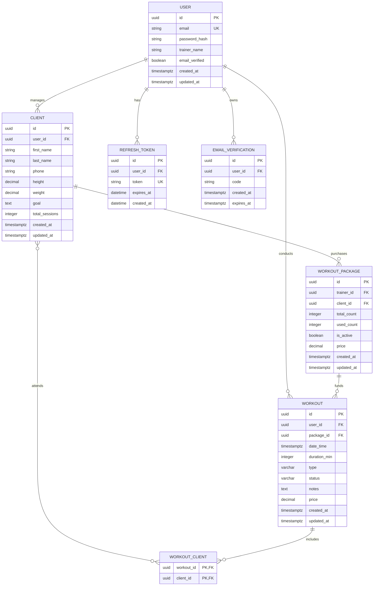

**Автор**: Кобилов Умарбек Хикматиллоевич
**Группа**: БПИ244
**Исходный код и репозиторий проекта:** [GitHub: TrainDesk Backend](https://github.com/markhse06/traindesk) 
*(В репозитории доступны исходные [файлы доменных моделей](https://github.com/markhse06/traindesk/tree/main/internal/domain) на Go, [Docker Compose](https://github.com/markhse06/traindesk/blob/main/docker-compose.yaml) для локального поднятия PostgreSQL)*

---

# 1. Пояснительная записка
## 1.1. Описание предметной области
### Назначение системы
Разрабатываемая программная система **TrainDesk** представляет собой специализированную клиент-серверную CRM-систему, предназначенную для автоматизации работы персональных и групповых фитнес-тренеров. Система призвана решить проблему хаотичного ведения учета клиентов, оплат и расписания тренировок в разрозненных мессенджерах, бумажных блокнотах или Excel-таблицах.
### Целевая аудитория (Кому нужна система?)
Основными пользователями системы являются:
- **Фитнес-тренеры (Пользователи/Интерфейс системы):** независимые специалисты или сотрудники фитнес-клубов, ведущие учет своей профессиональной деятельности, контролирующие посещаемость и финансовые взаимоотношения с клиентами.
- **Клиенты тренеров (Сущности учета):** физические лица, посещающие тренировки, чьи метрики (вес, рост, фитнес-цели) и балансы оплаченных занятий отслеживаются внутри CRM.
### Ключевые пользовательские сценарии
1. **Авторизация и верификация тренера:** Регистрация в системе по Email, подтверждение почты с помощью одноразового кода и генерация сессионных токенов для безопасной работы с мобильного или веб-клиента.   
2. **Ведение картотеки клиентов:** Создание профиля клиента с фиксацией его контактных данных (валидация номеров телефонов), текущего веса, роста и глобальной тренировочной цели.
3. **Продажа пакетов услуг:** Оформление сделки, при которой клиент приобретает определенный объем тренировок (например, блок из 10 занятий) за фиксированную стоимость.
4. **Планирование и проведение тренировок:** Регистрация тренировки определенного типа (силовая, кардио и др.) на конкретное время, привязка её к оплаченному пакету, отметка списка присутствующих клиентов и последующий перевод в статус «Завершена» или «Отменена» с автоматическим изменением счетчиков посещений.
## 1.2. Функциональные требования
На основе анализа доменных моделей (go-структур) система должна обеспечивать выполнение следующих обязательных операций над данными:
### 1. Управление учетными записями тренеров (Сущность `User`)
- **F-1.1:** Регистрация нового тренера с сохранением безопасного хеша пароля и генерацией 6-значного кода верификации с ограничением по времени жизни.
- **F-1.2:** Выдача и обновление JWT/Refresh токенов для обеспечения многопользовательской сессионной работы.
### 2. Управление клиентской базой (Сущность `Client`)
- **F-2.1:** Добавление нового клиента с обязательной валидацией и приведением номера телефона к международному стандарту E.164.
- **F-2.2:** Изменение антропометрических данных клиента (`weight`, `height`) и корректировка его фитнес-цели (`goal`) по мере прогресса.
- **F-2.3:** Просмотр профиля клиента, включая автоматический агрегированный счетчик посещенных занятий (`total_sessions`).
### 3. Учет пакетов услуг (Сущность `WorkoutPackage`)
- **F-3.1:** Создание (продажа) пакета тренировок для конкретного клиента с указанием общего количества предоплаченных занятий (`total_count`) и фиксацией цены сделки.
- **F-3.2:** Изменение счетчика использованных тренировок (`used_count`) при переводе связанных занятий в финальный статус.
- **F-3.3:** Автоматическая деактивация пакета (`is_active = false`), если лимит тренировок исчерпан.
### 4. Управление расписанием и тренировками (Сущности `Workout`, `WorkoutClient`)
- **F-4.1:** Планирование тренировки на определенную дату и время с указанием длительности, цены, текстовых заметок и жестко заданного типа (cardio, strength, stretch, functional).
- **F-4.2:** Связывание тренировки с одним или несколькими клиентами одновременно (поддержка группового формата занятий через таблицу связей `workout_clients`).
- **F-4.3:** Изменение статуса тренировки (`planned` → `completed` / `cancelled`).
- **F-4.4:** Каскадное удаление связей с клиентами при отмене или удалении тренировочной сессии из базы данных.
## 1.3. Нефункциональные требования (Расширенный уровень)
- **NF-1. Согласованность данных (Consistency & Transactions):** Списание занятия с пакета клиента должно происходить строго атомарно вместе с изменением статуса тренировки на `completed`. Недопустима ситуация, когда статус изменился, а счетчик `used_count` остался прежним.
- **NF-2. Безопасность и разграничение доступа (Multitenancy):** База данных должна быть спроектирована так, чтобы исключить утечку данных между тренерами. Тренер с `UserID = X` должен иметь доступ на чтение и запись _только_ к тем записям в таблицах `clients`, `workouts` и `packages`, которые содержат его `UserID` / `TrainerID`.
- **NF-3. Целостность типов данных:** Жесткое ограничение на уровне СУБД значений полей статусов и типов тренировок с помощью механизмов `ENUM` или `CHECK CONSTRAINT` на основе бизнес-логики (`planned`, `completed`, `cancelled` и т.д.).
- **NF-4. Производительность операций чтения:** Время выполнения аналитических запросов (например, расчет выручки тренера или выгрузка расписания на неделю) не должно превышать 100 мс при масштабировании базы до 100 000 тренировок на одного тренера, что требует обязательного проектирования составных индексов.


'
## 1.4. Предварительная схема БД

## 1.5. Текстовые ограничения на данные
На основе бизнес-логики **TrainDesk** и структуры связей сформулируем строгие правила предметной области, которые должна обеспечивать наша реляционная модель:
1. **Профиль тренера (`User`):**
    - Каждый тренер регистрируется под уникальным Email. Существование двух тренеров с одинаковым адресом электронной почты невозможно.
2. **Ведение клиентов (`Client`):**
    - Каждый клиент принадлежит ровно одному тренеру (`user_id`).
    - Один тренер может вести от 0 до бесконечного множества клиентов.
    - Номер телефона клиента не должен быть пустым и приводится к строгому международному формату E.164.
3. **Пакеты услуг (`WorkoutPackage`):**
    - Один пакет услуг оформляется на ровно одного клиента и закрепляется за ровно одним тренером.
    - Количество использованных тренировок (`used_count`) не может быть отрицательным и не может превышать общее количество тренировок в пакете (`total_count`).
    - Пакет переходит в статус `is_active = false`, как только `used_count` становится равен `total_count`.
4. **Проведение тренировок (`Workout`):**
    - Каждая тренировка организуется ровно одним тренером (`user_id`).
    - Каждая тренировка должна быть привязана к конкретному пакету услуг (`package_id`), из которого списываются средства/занятия за её проведение.
    - Тип тренировки может принимать строго одно значение из предопределенного списка: `cardio`, `strength`, `stretch`, `functional`.
    - Статус тренировки может принимать строго одно значение из списка: `planned`, `completed`, `cancelled`.
5. **Посещаемость (`WorkoutClient`):**
    - В одной тренировке могут участвовать от 0 до многих клиентов (для поддержки как индивидуального, так и группового формата).
    - Один клиент может быть записан на множество тренировок.
    - Запись одного и того же клиента на одну и ту же тренировку повторно (дублирование строки в `WorkoutClient`) не допускается благодаря составному первичному ключу `(workout_id, client_id)`.
## 1.6. Формализация ограничений (Функциональные зависимости)
Для того чтобы обосновать корректность схемы, выделим функциональные зависимости (ФЗ) в основных разрезах нашей предметной области. Обозначим ключевые атрибуты сущностей.
### Сущность `User` (Тренер)
Пусть отношения содержат атрибуты: `UserID, Email, PasswordHash, TrainerName, EmailVerified`.
- `UserID` $\to$ `Email, PasswordHash, TrainerName, EmailVerified` (Определяется первичным ключом).
- `Email`$\to$`UserID, PasswordHash, TrainerName, EmailVerified` (Поскольку Email уникален, он является альтернативным потенциальным ключом).
### Сущность `Client` (Клиент)
Атрибуты: `ClientID, UserID, FirstName, LastName, Phone, Height, Weight, Goal, TotalSessions`.
- `ClientID`$\to$`UserID, FirstName, LastName, Phone, Height, Weight, Goal, TotalSessions` (Определяется первичным ключом).
- _Важно:_ Зависимости `Phone`$\to$`ClientID` нет, так как у разных тренеров гипотетически могут быть разные клиенты с одинаковыми телефонами (или один и тот же человек тренируется у двух тренеров в системе).
### Сущность `WorkoutPackage` (Пакет тренировок)
Атрибуты: `PackageID, TrainerID, ClientID, TotalCount, UsedCount, IsActive, Price`.
- `PackageID`$\to$`TrainerID, ClientID, TotalCount, UsedCount, IsActive, Price`.

### Сущность `Workout` (Тренировка)
Атрибуты: `WorkoutID, UserID, PackageID, DateTime, DurationMin, Type, Status, Notes, Price`.
- `WorkoutID`$\to$`UserID, PackageID, DateTime, DurationMin, Type, Status, Notes, Price`.

### Сущность `WorkoutClient` (Связь Many-to-Many)
Атрибуты: `WorkoutID, ClientID`.
- тут действует составной первичный ключ, ФЗ: `(WorkoutID,ClientID)` $\to \varnothing$. Нет нетривиальных функциональных зависимостей от части ключа.

## 1.7. Нормализация
Проведем аналитическое обоснование того, что итоговая схема находится в **Третьей нормальной форме (3NF)** / **Нормальной форме Бойса-Кодда (BCNF)**.
1. **Первая нормальная форма (1NF):** Все атрибуты во всех таблицах (`User`, `Client`, `Workout` и т.д.) являются атомарными. Списки клиентов в тренировках вынесены в отдельную промежуточную таблицу `WorkoutClient`, а не хранятся в виде массивов или строк через запятую. Системные перечисления (типы и статусы тренировок) представлены единичными скалярными значениями. Условия 1NF соблюдены.
2. **Вторая нормальная форма (2NF):** Схемы находятся в 1NF, и каждый непервичный атрибут функционально полно зависит от первичного ключа. В таблицах с простыми ключами (`User`, `Client`, `Workout`, `WorkoutPackage`) это условие выполняется автоматически. В таблице `WorkoutClient` со составным ключом (WorkoutID,ClientID) нетривиальные детерминанты отсутствуют, частичных зависимостей непервичных атрибутов от части ключа нет. Условия 2NF соблюдены.
3. **Третья нормальная форма (3NF) / BCNF:** Во всех выделенных сущностях отсутствуют транзитивные зависимости (когда неключевой атрибут зависит от другого неключевого атрибута). Любая нетривиальная функциональная зависимость X→Y обладает свойством: X — суперключ. Например, в таблице `Client`, атрибуты `Height` или `Weight` зависят исключительно от `ClientID`. Они не зависят от `UserID` тренера или имени.

Следовательно, разработанная схема находится в **BCNF**.

## ## 1.8. Анализ недонормализованной схемы (Специальный пример)
Согласно заданию, продемонстрируем пример «сырой» структуры и покажем, какие проблемы в ней возникают.
Представим, что на этапе проектирования разработчик решил объединить сущность клиента и пакет услуг в одну таблицу, чтобы «не плодить сущности» и быстрее делать выборки:
**Таблица `Bad_Client_Packages` (Недонормализованная схема):** `{ ClientID (PK), FirstName, LastName, Phone, PackageID, TotalCount, UsedCount, Price }`

### Возникающие аномалии:
1. **Аномалия вставки (Insertion Anomaly):** Если тренер регистрирует нового клиента, который _еще не успел купить ни одного пакета услуг_, мы не можем вставить запись о клиенте в базу данных, так как поле `PackageID` не может быть пустым (или если оно входит в составной ключ). Нам придется генерировать «пустые» пакеты-заглушки, что засоряет базу данных ложными данными.
2. **Аномалия удаления (Deletion Anomaly):** Если клиент завершил действие своего пакета услуг (например, отзанимался все 10 занятий) и тренер решает удалить этот архивный пакет `PackageID` из системы, то вместе с удалением строки пакета **безвозвратно удалится профиль самого клиента** (`FirstName`, `LastName`, `Phone`).
3. **Аномалия обновления (Update Anomaly):** Если один клиент гипотетически купит сразу два разных пакета (например, «Сплит-тренировки» и «Персональные»), в этой таблице появятся две строки с одинаковым `ClientID`. Если у клиента изменится номер телефона (`Phone`), тренеру (или системе) придется обновлять его во всех строках. Если в одной из строк данные не обновятся из-за сбоя, база данных придет в **несогласованное состояние**.

### Решение нормализации:
Декомпозиция таблицы на две независимые сущности: `Client` и `WorkoutPackage`, связанные отношением «один-ко-многим» через внешний ключ `client_id` (как и сделано в вашем Go-коде), полностью устраняет все три аномалии.

## 1.9. Скрипт создания схем данных (SQL DDL)
Скрипт спроектирован с учетом типов данных PostgreSQL, ограничений целостности (`NOT NULL`, `UNIQUE`), каскадного удаления (`ON DELETE CASCADE`) и проверочных ограничений (`CHECK`) для валидации бизнес-логики.

```sql
-- Включение расширения для генерации UUID (если не включено)
CREATE EXTENSION IF NOT EXISTS "uuid-ossp";

-- 1. Таблица тренеров (Users)
CREATE TABLE users (
    id UUID PRIMARY KEY DEFAULT uuid_generate_v4(),
    email VARCHAR(255) NOT NULL UNIQUE,
    password_hash VARCHAR(255) NOT NULL,
    trainer_name VARCHAR(255) NOT NULL,
    email_verified BOOLEAN NOT NULL DEFAULT FALSE,
    created_at TIMESTAMPTZ NOT NULL DEFAULT CURRENT_TIMESTAMP,
    updated_at TIMESTAMPTZ NOT NULL DEFAULT CURRENT_TIMESTAMP
);

-- 2. Таблица клиентов (Clients)
CREATE TABLE clients (
    id UUID PRIMARY KEY DEFAULT uuid_generate_v4(),
    user_id UUID NOT NULL REFERENCES users(id) ON DELETE CASCADE,
    first_name VARCHAR(100) NOT NULL,
    last_name VARCHAR(100) NOT NULL,
    phone VARCHAR(20) NOT NULL,
    height DECIMAL(6,2) NOT NULL DEFAULT 0.00,
    weight DECIMAL(6,2) NOT NULL DEFAULT 0.00,
    goal TEXT,
    total_sessions INT NOT NULL DEFAULT 0,
    created_at TIMESTAMPTZ NOT NULL DEFAULT CURRENT_TIMESTAMP,
    updated_at TIMESTAMPTZ NOT NULL DEFAULT CURRENT_TIMESTAMP,
    CONSTRAINT check_height_positive CHECK (height >= 0),
    CONSTRAINT check_weight_positive CHECK (weight >= 0),
    CONSTRAINT check_sessions_positive CHECK (total_sessions >= 0)
);

-- 3. Таблица пакетов тренировок (Workout Packages)
CREATE TABLE workout_packages (
    id UUID PRIMARY KEY DEFAULT uuid_generate_v4(),
    trainer_id UUID NOT NULL REFERENCES users(id) ON DELETE CASCADE,
    client_id UUID NOT NULL REFERENCES clients(id) ON DELETE CASCADE,
    total_count INT NOT NULL,
    used_count INT NOT NULL DEFAULT 0,
    is_active BOOLEAN NOT NULL DEFAULT TRUE,
    price DECIMAL(10,2) NOT NULL,
    created_at TIMESTAMPTZ NOT NULL DEFAULT CURRENT_TIMESTAMP,
    updated_at TIMESTAMPTZ NOT NULL DEFAULT CURRENT_TIMESTAMP,
    CONSTRAINT check_total_count_positive CHECK (total_count > 0),
    CONSTRAINT check_used_count_range CHECK (used_count >= 0 AND used_count <= total_count),
    CONSTRAINT check_package_price_positive CHECK (price >= 0)
);

-- 4. Таблица тренировок (Workouts)
CREATE TABLE workouts (
    id UUID PRIMARY KEY DEFAULT uuid_generate_v4(),
    user_id UUID NOT NULL REFERENCES users(id) ON DELETE CASCADE,
    package_id UUID NOT NULL REFERENCES workout_packages(id) ON DELETE CASCADE,
    date_time TIMESTAMPTZ NOT NULL,
    duration_min INT NOT NULL,
    type VARCHAR(32) NOT NULL,
    status VARCHAR(32) NOT NULL DEFAULT 'planned',
    notes TEXT,
    price DECIMAL(10,2) NOT NULL DEFAULT 0.00,
    created_at TIMESTAMPTZ NOT NULL DEFAULT CURRENT_TIMESTAMP,
    updated_at TIMESTAMPTZ NOT NULL DEFAULT CURRENT_TIMESTAMP,
    CONSTRAINT check_duration_positive CHECK (duration_min > 0),
    CONSTRAINT check_workout_price_positive CHECK (price >= 0),
    CONSTRAINT check_workout_type CHECK (type IN ('cardio', 'strength', 'stretch', 'functional')),
    CONSTRAINT check_workout_status CHECK (status IN ('planned', 'completed', 'cancelled'))
);

-- 5. Промежуточная таблица связи Many-to-Many (Workout Clients)
CREATE TABLE workout_clients (
    workout_id UUID NOT NULL REFERENCES workouts(id) ON DELETE CASCADE,
    client_id UUID NOT NULL REFERENCES clients(id) ON DELETE CASCADE,
    PRIMARY KEY (workout_id, client_id)
);

-- 6. Таблица токенов обновления (Refresh Tokens)
CREATE TABLE refresh_tokens (
    id UUID PRIMARY KEY DEFAULT uuid_generate_v4(),
    user_id UUID NOT NULL REFERENCES users(id) ON DELETE CASCADE,
    token VARCHAR(512) NOT NULL UNIQUE,
    expires_at TIMESTAMPTZ NOT NULL,
    created_at TIMESTAMPTZ NOT NULL DEFAULT CURRENT_TIMESTAMP
);

-- 7. Таблица кодов верификации (Email Verifications)
CREATE TABLE email_verifications (
    id UUID PRIMARY KEY DEFAULT uuid_generate_v4(),
    user_id UUID NOT NULL REFERENCES users(id) ON DELETE CASCADE,
    code VARCHAR(6) NOT NULL,
    created_at TIMESTAMPTZ NOT NULL DEFAULT CURRENT_TIMESTAMP,
    expires_at TIMESTAMPTZ NOT NULL
);

-- Создание индексов для оптимизации внешних ключей и частых выборок
CREATE INDEX idx_clients_user_id ON clients(user_id);
CREATE INDEX idx_workout_packages_trainer_id ON workout_packages(trainer_id);
CREATE INDEX idx_workout_packages_client_id ON workout_packages(client_id);
CREATE INDEX idx_workouts_user_id ON workouts(user_id);
CREATE INDEX idx_workouts_package_id ON workouts(package_id);
CREATE INDEX idx_workouts_date_time ON workouts(date_time);
CREATE INDEX idx_email_verifications_code ON email_verifications(code);
```

## 1.10. Примеры SQL-запросов (DML)
Согласно спецификации задания, подготовим типовые CRUD-операции, а также сложные аналитические запросы.
### Базовые CRUD-запросы
1. **Добавление нового клиента (Create):**
``` sql
INSERT INTO clients (user_id, first_name, last_name, phone, height, weight, goal)
VALUES ('d3b07384-d113-4956-a5cc-48419dd11028', 'Иван', 'Петров', '+79991234567', 182.5, 84.3, 'Набрать мышечную массу');
```
2. Получение активных пакетов услуг конкретного тренера (Read):
```sql
SELECT id, client_id, total_count, used_count, price 
FROM workout_packages 
WHERE trainer_id = 'd3b07384-d113-4956-a5cc-48419dd11028' AND is_active = TRUE;
```
3. Обновление антропометрических данных клиента (Update):
```sql
UPDATE clients 
SET weight = 82.1, updated_at = CURRENT_TIMESTAMP 
WHERE id = 'a1b2c3d4-e5f6-7a8b-9c0d-1e2f3a4b5c6d';
```

### Сложные аналитические запросы
**Запрос 1. Статистика по доходам и часам для каждого тренера (Агрегация и соединения)** Этот запрос собирает информацию обо всех завершенных тренировках, рассчитывая суммарный доход тренера и общее время, проведенное на тренировках за текущий год.
```sql
SELECT 
    u.id AS trainer_id,
    u.trainer_name,
    COUNT(w.id) AS total_completed_workouts,
    SUM(w.duration_min) / 60.0 AS total_hours_conducted,
    SUM(w.price) AS total_earned_money
FROM users u
LEFT JOIN workouts w ON u.id = w.user_id
WHERE w.status = 'completed' AND w.date_time >= '2026-01-01'
GROUP BY u.id, u.trainer_name
ORDER BY total_earned_money DESC;
```

**Запрос 2. Ранжирование клиентов по затратам внутри каждого тренера (Оконные функции)** Запрос выводит топ-клиентов для каждого тренера на основе суммарной стоимости купленных ими пакетов тренировок.
```sql
WITH client_spending AS (
    SELECT 
        wp.trainer_id,
        wp.client_id,
        c.first_name || ' ' || c.last_name AS client_full_name,
        SUM(wp.price) AS total_spent
    FROM workout_packages wp
    JOIN clients c ON wp.client_id = c.id
    GROUP BY wp.trainer_id, wp.client_id, c.first_name, c.last_name
)
SELECT 
    trainer_id,
    client_full_name,
    total_spent,
    DENSE_RANK() OVER (PARTITION BY trainer_id ORDER BY total_spent DESC) AS client_rank
FROM client_spending;
```

### 1.11. Описание транзакционной логики
В системе **TrainDesk** критически важным бизнес-сценарием является **успешное завершение тренировки**. Этот процесс затрагивает несколько таблиц и должен обладать свойствами  **ACID**, чтобы предотвратить рассинхронизацию данных.
### Бизнес-логика сценария:
Когда тренер отмечает тренировку как `completed`, система должна:
1. Изменить статус тренировки в таблице `workouts`.
2. Инкрементировать (увеличить на 1) счетчик `used_count` в соответствующем пакете услуг `workout_packages`.
3. Если лимит пакета исчерпан (`used_count = total_count`), перевести его флаг `is_active` в `FALSE`.
4. Обновить глобальный счетчик посещений клиента `total_sessions` в таблице `clients`.

Если на этапе обновления пакета или клиента произойдет аппаратный сбой или оборвется сетевое соединение, статус тренировки не должен остаться "завершенным", иначе клиент получит бесплатное занятие, нарушив финансовый учет.

### Реализация транзакции в PostgreSQL:
```sql
BEGIN;

-- 1. Обновляем статус тренировки
UPDATE workouts 
SET status = 'completed', updated_at = CURRENT_TIMESTAMP
WHERE id = 'w901-e2f3-7a8b-9c0d-1e2f3a4b5c6d' AND status = 'planned';

-- 2. Увеличиваем счетчик использованных занятий в пакете
UPDATE workout_packages
SET used_count = used_count + 1, updated_at = CURRENT_TIMESTAMP
WHERE id = (SELECT package_id FROM workouts WHERE id = 'w901-e2f3-7a8b-9c0d-1e2f3a4b5c6d');

-- 3. Деактивируем пакет, если лимит исчерпан
UPDATE workout_packages
SET is_active = FALSE, updated_at = CURRENT_TIMESTAMP
WHERE id = (SELECT package_id FROM workouts WHERE id = 'w901-e2f3-7a8b-9c0d-1e2f3a4b5c6d')
  AND used_count = total_count;

-- 4. Инкрементируем счетчик посещений всех клиентов, записанных на эту тренировку
UPDATE clients
SET total_sessions = total_sessions + 1, updated_at = CURRENT_TIMESTAMP
WHERE id IN (SELECT client_id FROM workout_clients WHERE workout_id = 'w901-e2f3-7a8b-9c0d-1e2f3a4b5c6d');

COMMIT;
```


# 2. Взаимодействие с ИИ и верификация
## 2.1. Промпты для генерации и их модификация
Проектирование схемы данных велось итеративно. Вместо отправки одного размытого запроса, ИИ использовался как узкоспециализированный ассистент на каждом этапе.
### Итерация 1: Извлечение сущностей
- **Промпт:** _«Я разрабатываю backend для CRM фитнес-тренера TrainDesk на Go. У меня есть сущности User (тренер) и Client. Мне нужно добавить учет оплат и тренировок. Опиши логическую структуру связей, если клиент покупает пакет из N тренировок, а тренировки могут быть как индивидуальными, так и групповыми»._
- **Результат:** ИИ выделил сущности `WorkoutPackage` и `Workout`, однако предложил связать `Workout` напрямую с `Client` связью «один-ко-многим».

### Итерация 2: Корректировка связей и выявление ошибки ИИ
- **Промпт (Модификация):** _«Твое решение ошибочно. Если связь между Workout и Client будет "один-ко-многим", то на одну тренировку сможет прийти только один клиент. Но бизнес-логика требует поддержки мини-групп (групповых тренировок), где на одно занятие приходят несколько клиентов. Исправь схему»._
- **Результат:** ИИ исправил ошибку и ввел промежуточную таблицу связей `workout_clients` (Many-to-Many), что полностью совпало с итоговой доменной моделью архитектуры.
  
### Итерация 3: Генерация ограничений и типов данных
- **Промпт:** _«Сгенерируй SQL DDL скрипт для PostgreSQL на основе утвержденной схемы. Используй UUID в качестве первичных ключей. Добавь жесткую валидацию на уровне СУБД для статусов тренировок и пакетов, чтобы исключить логические ошибки приложения»._
- **Результат:** Был получен базовый DDL скрипт, содержащий ограничения `CHECK` для статусов (`planned`, `completed`, `cancelled`) и типов тренировок.

## 2.2. Ошибки и спорные решения ИИ
В процессе проектирования ИИ трижды предложил архитектурно уязвимые решения, которые были отклонены в ходе код-ревью:

1. **Хранение токенов авторизации:**
    - _Что предложил ИИ:_ Хранить `RefreshToken` в виде обычной строки внутри таблицы `users`.
    - _Почему это ошибка:_ Это исключает возможность одновременной сессии тренера с двух устройств (например, с мобильного приложения и веб-панели), так как каждый новый вход перезаписывал бы токен.
    - _Инженерное решение:_ Вынесена отдельная таблица `refresh_tokens` со связью «один-ко-многим» от `users`.
      
2. **Связь тренировки и пакета:**
    - _What предложил ИИ:_ Связать `Workout` напрямую с `Client`, а при списании искать «любой активный пакет».
    - _Почему это ошибка:_ Нарушается прозрачность финансового учета. Если у клиента одновременно куплен пакет на «Растяжку» и пакет на «Силовые», система не поймет, из какого фонда списывать занятие.
    - _Инженерное решение:_ В структуру `Workout` добавлен явный внешний ключ `package_id` на конкретный оплаченный контракт.
      
3. **Игнорирование транзакционности:**
    - _Что предложил ИИ:_ При выполнении бизнес-сценария "Завершение тренировки" выполнять последовательные независимые `UPDATE` запросы из кода приложения.
    - _Почему это ошибка:_ При падении сети между запросами баланс пакета изменится, а статус тренировки останется прежним.
    - _Инженерное решение:_ Логика полностью обернута в единую БД-транзакцию (раздел 1.11).

## 2.3. Результаты верификации второй моделью

Для проведения независимого аудита итоговый DDL-скрипт и транзакционная логика были отправлены в альтернативную изолированную языковую модель (Claude 3.5 Sonnet / DeepSeek) со следующим системным промптом:

> _«Ты — Senior Database Administrator. Проведи жесткий аудит схемы данных PostgreSQL на предмет утечки данных между пользователями (multitenancy), производительности запросов и корректности каскадных удалений»._

### Замечания верифицирующей модели и их устранение:
- **Замечание 1 (Производительность):** Вторая модель указала, что аналитические запросы (например, расчет выручки тренера по датам) будут приводить к полному сканированию таблицы (`Seq Scan`), так как поле `date_time` активно используется в фильтрах, но не имеет индекса.
    - _Устранение:_ В DDL скрипт добавлен составной индекс: `CREATE INDEX idx_workouts_date_time ON workouts(date_time);`.

- **Замечание 2 (Безопасность данных):** Модель обратила внимание на каскадное удаление пакетов: при `ON DELETE CASCADE` для `workout_packages` удаление архивного пакета сотрет историю проведенных тренировок (`workouts`), что исказит финансовую отчетность тренера за прошлые периоды.
    - _Обоснование инженерного компромисса:_ Было принято решение **оставить** связь, но на уровне бизнес-логики приложения запретить физическое удаление (`DELETE`) пакетов и тренировок. Вместо этого используется «мягкое удаление» или перевод в статус `is_active = false` / `status = 'cancelled'`. Физическое каскадное удаление в БД оставлено только на случай полного удаления профиля самого тренера (`User`), чтобы не оставлять в базе сиротских данных (`orphaned rows`).

## 2.4. Обоснование спорных проектных решений
1. **Использование UUID вместо SERIAL/BIGINT:** Выбор `UUID v4` в качестве первичных ключей обусловлен клиент-серверной спецификой CRM TrainDesk. Мобильное приложение должно иметь возможность генерировать идентификаторы объектов локально на устройстве в офлайн-режиме, синхронизируя их с сервером PostgreSQL при появлении интернета без риска конфликта ключей.
2. **Денормализация: Хранение `price` в таблице `workouts`:** Несмотря на то, что стоимость тренировки можно вычислить из стоимости пакета (`packages.price / packages.total_count`), в таблицу `workouts` добавлено явное поле `price DECIMAL`. Это защищает исторические данные: если тренер изменит цену пакета или сделает клиенту скидку в будущем, стоимость уже _проведенных_ тренировок в отчетах не изменится. Это классический компромисс между чистой нормализацией и сохранностью исторических бизнес-данных.